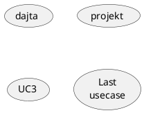

# SIEMAAAAA <!-- omit in toc -->

- [1. BYLECO](#1-byleco)
- [2. DUPA](#2-dupa)
- [3. DUPA2](#3-dupa2)
- [4. DUPA NR 3](#4-dupa-nr-3)
- [DUPA 5](#dupa-5)
- [dupa 6](#dupa-6)
- [dupa 7](#dupa-7)

## 1. BYLECO

```java
System.out.println("dsadas");
```

## 2. DUPA

siema a a a a a

## 3. DUPA2

dsabfdskalbghdlsabgdlsa




## 4. DUPA NR 3

**dsafdsbhajk** *dasdasda*

>bedziecie mieli projekt kiedys

## DUPA 5

kolumna1 | kolumna2 | kolumna3
:--- | :---: | ---:
dsa | bsa | daa
python | pythoniara | jesieniara

## dupa 6

- [ ] task1
- [x] task2
- [ ] task3

## dupa 7

- dasdas
- dsa
- das
- d
- asd
- as
- d
  - dsadas 
  - das
  - dasdas
- dsa
- dsa

1. das
2. das
3. dsa
4. d
5. asd
6. a

